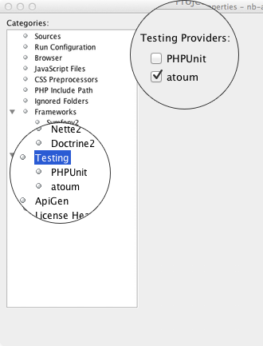
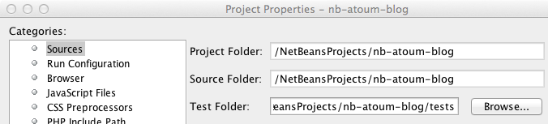
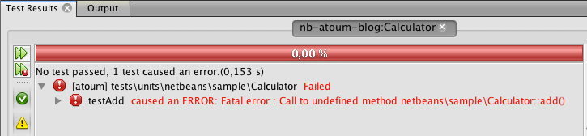
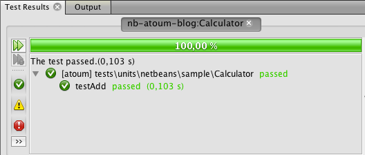
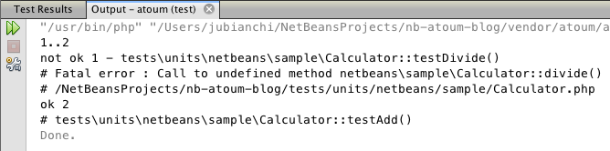
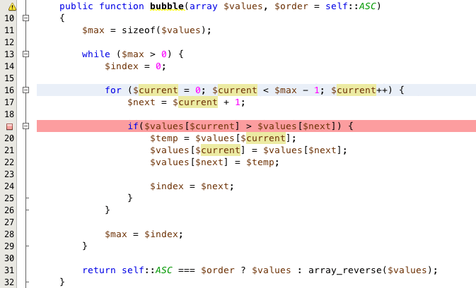
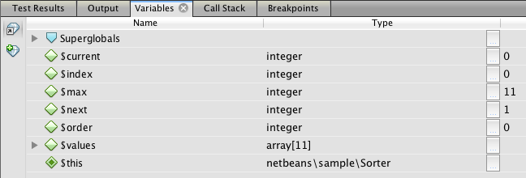
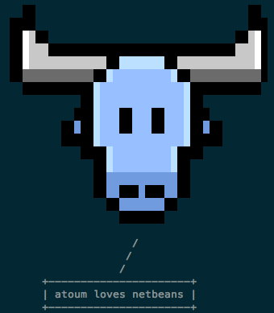

### Netbeans + atoum = love <3

Hi all! If you are here today, it's because you know and probably use [Netbeans](https://netbeans.org/features/php/). But you probably don't know [atoum](http://atoum.org) yet. Too bad, you missed one of the most powerfull and pleasant to use unit testing framework for PHP. Today, atoum is directly integrated in Netbeans and I'm here to introduce this new feature.

We, the atoum team, have one main goal: to provide users a modern, simple and intuitive tool to write unit tests. Integrating atoum in an IDE is a step farther to ease the use of such a tool. In this blog post, I'll try to cover the main functionalities: we will bootstrap a new project using atoum, configure it to be able to trigger our tests and then, we'll see how to debug them. Do not worry, thanks to Tomas and all the Netbeans' team work, this will be easy and will only happen through the Netbeans' user interface.

#### Bootstrapping

Once you have created your new Netbeans project, you will have to build a basic directory structure. Let's use something like this:

```
.
├── src
│   └── netbeans
│       └── sample
└── tests
    └── units
        └── netbeans
            └── sample
```

What does this tell us ? We prepared our project to host a ```netbeans\sample``` namespace where we will put our sources and a directory to host our tests. The last thing to do before writing the first line of code is to include atoum. atoum is available as a [PHAR archive](http://downloads.atoum.org/nightly/mageekguy.atoum.phar), a [composer package](https://packagist.org/packages/atoum/atoum), or [on Github](https://github.com/atoum/atoum). In the example I'll use [composer](http://getcomposer.org/) with the following content in the ```composer.json``` file:

```
{
    "name": "netbeans/sample",
    "description": "Netbeans + atoum = love <3",
    "require-dev": {
        "atoum/atoum": "dev-master"
    },
    "autoload": {
        "psr-0": {
            "netbeans\\sample": "src"
        }
    }
}
```

This could be automatically generated with Netbeans but I won't cover this step in detail here as it's the matter of one click: right click on your project name and choose Composer and then Install. As soon as you have your dependencies installed, you will be ready to continue.

#### Configuring

This is where we will start using Netbeans features. Let's start by opening the project properties window (right-click on the project name and select "Properties" then go to the "Testing" item in the left tree):



Now, we have to tell Netbeans which directory will hold our tests (still in project's properties, go to the "Sources" item in the left tree):



Use the "Browse" button next to the "Test folder" field and choose the ```tests``` directory. You can now save the settings and see that Neatbeans marks the ```tests``` as a special folder: "Test Files". This will let it automatically find your test files based on your source filenames.

For now, that's all you need to do to make Netbeans use atoum to run your tests. I told you atoum was a really simple tool: it's a self-contained tool and can run your test without any configuration! Netbeans takes full advantage of this and only asks you to choose your favorite tool by checking a single option! Of course, when you'll be more familiar with the tool, you'll be able to customize it more precisely.

For basic use cases, this should be sufficient and we can go to the next step: writing our first unit test because TDD is a good practice and atoum is oriented on this way of working (but you can also use it other way).

#### Writing unit tests

Before we start writing tests, let me explain some points I skipped until now: when we prepared our workspace, we created a deep tree in the tests directory. This is something that is required by atoum: you have to use namespace to structure your sources and tests and the tests should live in a namespace matching ```tests\units``` and your source namespace. In our example, our tests will live in the ```tests\units\netbeans\sample``` namespace as our sources are in ```netbeans\sample```. We also follow the PSR-0 convention so our directories match the namespaces to ease autoloading.

So let's go! We want to write a Calculator class which will provide some basic operations: add, multiply and divide. Let's create the file ```tests/units/netbeans/sample/Calculator.php```:

```
<?php
namespace tests\units\netbeans\sample;

use atoum;

require __DIR__ . '/../../../../vendor/autoload.php';

class Calculator extends atoum {
    public function testAdd() {
        $this
                ->if($object = new \netbeans\sample\Calculator())
                ->then
                    ->integer($object->add(1, 2))->isEqualTo(3)
        ;
    }
}
```

We now have our first unit test, so just launch it: click on its filename in the left tree and, as you prefer, use the CMD+F6 shortcut on Mac OS X or use the right-click menu and select "Run". Netbeans should display the result of the test run, saying that a test failed. Exactly what we expect: we tested a method which we don't have yet implemented (TDD FTW!):



What we have to do now is create our tested class and write the ```add``` method to make our test pass. Ass I told you, atoum and Netbeans expect your project to be PSR-0 compliant so our class will lay in the ```src/netbeans/sample``` directory:

```
<?php
namespace netbeans\sample;

class Calculator {
    public function add($a, $b) {
        return $a + $b;
    }
}
```

Using you prefered trigger, you can now rerun the unit test and see that everything is now green!



This is how netbeans will report the tests results : a shiny progress bar and a list of ran test cases. If you are curious, you will also be able to see the command used to run tests and the raw output produced by atoum which is provided in the [TAP format](http://podwiki.hexten.net/TAP/TAP.html?page=TAP "TAP format") (I bet you won't want to read this but it's still interesting to know how everything works under the hood):



I won't cover the other test methods and let you discover them [here](https://github.com/jubianchi/atoum-sample). Using TDD, you will now be able to quickly write a test, run it, see it's failing, switch to your source file (ALT+CMD+T on Mac OS X), write some code to make the test pass, run it, see it's passing, switch to the test (again with ALT+CMD+T), write a failing test, … This is how we do!

We will now switch to a new example to discover another feature: using XDebug to debug our code.

#### Debugging

Netbeans and atoum allow you to easily debug your code using XDebug. This is really handy when dealing with complex classes and tests. To show you how everything works, I'll use a ```Sorter``` class which has one method to do a bubble sorting on an array.

But before we can use XDebug with atoum, we'll have to do a bit of configuration. Here is the configuration used for the example:

```
zend_extension=xdebug.so

xdebug.idekey="netbeans-xdebug"
xdebug.remote_enable=1
xdebug.remote_autostart=0
```

What we do here is tell XDebug which IDE key will be used during debug session and enable remote debugging. ```remote_autostart``` will prevent atoum's child processes to automatically trigger a new session (yes, atoum runs every test in a single isolated PHP process!). If you want to know more about how to configure XDebug for a Netbeans usage, check out this [documentation](http://wiki.netbeans.org/HowToConfigureXDebug "Netbeans XDebug configuration")

We are now ready to debug! To start your test in debug mode, you can chose between a keyboard shortcut (CMD+Shift+F5 on Mac OS X) or by right-clicking on the test file and choosing "Debug". But before triggering tests, you will have to put some breakpoint in your code so you can control the execution flow using debugger tools (Step over, step into, …).



Being able to run s step-by-step debugger in unit tests context will help you debug your code as you can make a specific behavior happen and track the execution in detail using the call stack and variables inspectors. 



Nothing really new compared to a conventional debugger session but still useful.

I hope the blog post made a good introduction to atoum in Netbeans, and perhaps made you want to test it. Of course, you will find all the code related to this post [on Github](https://github.com/jubianchi/atoum-sample). Feel free to check it out, try it and enjoy using atoum in Netbeans!

I wanted to thank everyone who worked on these awesome features, [Tomáš Myšík](https://twitter.com/tmysik) for his work on Netbeans but also the entire Netbeans team and all the contributors who helped us make this happen. Finally, if you want to know more about atoum or need help, feel free to join us on [IRC](irc://irc.freenode.net/##atoum) or have a look at the [documentation](http://docs.atoum.org).

